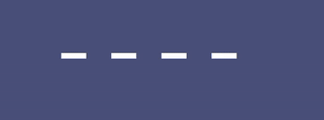

# PinView

A fully customizable PinView library for Android.

  

## Dependency

``` Groovy
allprojects {
  repositories {
    ...
    maven { url "https://jitpack.io" }
  }
}

dependencies {
        implementation 'com.github.neophron88:PinView:1.4.2'
}
```

## Basic Usage

You need to provide a `pinItemLayout` that will be inflated as much as you specify in the `pinCount`
attribute.
Each entered character will be displayed in items corresponding to the position.

Creating an item layout in `layout/item_layout.xml`

``` xml
<FrameLayout 
    android:id="@+id/pin_container"
    android:layout_width="wrap_content"
    android:layout_height="wrap_content"
    android:layout_marginHorizontal="5dp"
    android:background="@color/orange_200"
    android:clipToPadding="false"
    android:paddingHorizontal="10dp"
    android:paddingVertical="13dp">
    
    <View
        android:id="@+id/pin_cursor"
        android:layout_width="1.8dp"
        android:layout_height="26sp"
        android:layout_gravity="center"
        android:background="@color/orange_200"
        android:visibility="invisible" />
    
    <TextView
        android:id="@+id/pin_text_view"
        android:layout_width="wrap_content"
        android:layout_height="wrap_content"
        android:layout_gravity="center"
        android:ems="1"
        android:fontFamily="@font/montserrat_medium"
        android:gravity="center"
        android:textColor="@color/white"
        android:textSize="20sp"
        tools:text="M" />

</FrameLayout>

```

Add PinView to your XML like any other view and provide `pinItemLayout` attribute.

``` xml
<com.pulchukur.pinview.PinView
    android:id="@+id/pin_view"
    android:layout_width="wrap_content"
    android:layout_height="wrap_content"
    app:pinCount="6"
    app:pinImeOptions="actionDone"
    app:pinInputType="number"
    app:pinItemLayout="@layout/item_layout_1" />
```

In order for PinView to at least start responding to input, you need to specify the ID view from
pinItemLayout, which should appear and disappear depending on the characters entered.

``` xml
<com.pulchukur.pinview.PinView
    ...
    app:pinAppearanceBehaviorApplyToViewWithId="@id/pin_text_view"
    ...
/>
```

Above it was indicated which view from pinItemLayout will have the Appearance visual behavior. In
our case it is `@id/pin_text_view` from `@layout/item_layout`.

it's the result:
<p></p>

You can change the animation type or duration time via attributes `pinAppearanceBehaviorAnimation`, `pinAppearanceBehaviorAnimationDuration`.

``` xml
<com.pulchukur.pinview.PinView
    ...
    app:pinAppearanceBehaviorAnimation="fromBottomToBottom"
    app:pinAppearanceBehaviorAnimationDuration="300"
    ...
/>
```


If you want to change the visual of an item depending on item state(Active,InActiveFilled,InActiveEmpty), specify `pinTransitionBehaviorApplyToViewWithId`.

Specify the colors  `pinTransitionBehaviorColorActive`, `pinTransitionBehaviorColorEmptyInactive`, `pinTransitionBehaviorColorFilledInactive` ( by default has pinTransitionBehaviorColorActive color).

`pinTransitionBehaviorDrawableShape` attribute , valid values - rectangle or oval.

`pinTransitionBehaviorDrawableShapeColorTransitionAttr` - This xml attribute specifies the color of which drawable attribute to change when the state changes, valid values - solid, stroke, none

``` xml
<com.pulchukur.pinview.PinView
    ...
    app:pinTransitionBehaviorApplyToViewWithId="@id/pin_container"
    app:pinTransitionBehaviorColorActive="@color/yellow"
    app:pinTransitionBehaviorColorEmptyInactive="@color/white"
    app:pinTransitionBehaviorDrawableShape="rectangle"
    app:pinTransitionBehaviorDrawableShapeColorTransitionAttr="stroke"
    app:pinTransitionBehaviorDrawableShapeCornersRadius="12dp"
    app:pinTransitionBehaviorDrawableShapeStrokeWidth="2dp"
    ...
/>
```

It is also possible to specify default static colors for drawable attributes using `pinTransitionBehaviorDrawableShapeStrokeColor` and `pinTransitionBehaviorDrawableShapeSolidColor`.

it's the result:
<p></p>

For the cursor we use `pinCursorBehaviorApplyToViewWithId`

``` xml
<com.pulchukur.pinview.PinView
    ...
    app:pinCursorBehaviorApplyToViewWithId="@id/pin_cursor"
    ...
/>
```

PinView text change listener:
``` kotlin
val pinView = findViewById<PinView>(R.id.pin_view)

pinView.pinAddOnTextChangeListener { TODO() }
```

Also possible to set a forced state
``` kotlin
val pinView = findViewById<PinView>(R.id.pin_view)
pinView.pinForcedState = PinView.State.Error
/* or */ pinView.pinForcedState = PinView.State.Success
/* or */ pinView.pinForcedState = PinView.State.Default
```

By default for pinTransitionBehaviorView, the error color is red, and the color for success is green, but you can change it if necessary using attributes `pinTransitionBehaviorColorError` and `pinTransitionBehaviorColorSuccess`
``` xml
<com.pulchukur.pinview.PinView
    ...
   app:pinTransitionBehaviorColorSuccess="@color/green"
   app:pinTransitionBehaviorColorError="@color/red"
    ...
/>
```

## Advanced Usage
If you want to implement your visual behavior for a specific view on a pin item, this can be done by implementing an abstract class `PinView.VisualBehavior`.

By default, the following behaviors are available out of the box that you have previously used: `class PinBehaviorTransitionSolid`, `class PinBehaviorTransitionStroke`, `class PinBehaviorAnimatedAppearance`, `class PinBehaviorCursor`.

This is how you can add the Appearance visual behavior from code.
``` kotlin
val pinView = findViewById<PinView>(R.id.pin_view)
pinView.pinAddVisualBehaviorProducer(R.id.pin_text_view) { position, target ->
    PinBehaviorAnimatedAppearance(
        targetView = target,
        animator = PinAnimFromBottomToTop(translationRelativeTo = pinView.pinItems[position])
    )
}
pinView.pinRecompose()
```

Let's implement a custom behavior, let's call it `PinBehaviorPlaceholder`.

``` kotlin
class PinBehaviorPlaceholder(targetView: View) : PinView.VisualBehavior(targetView) {

    override fun onStateChanged(state: PinView.ItemState) {
        targetView.isInvisible = state is PinView.ItemState.InActiveFilled
    }
    
}
```
In the `onStateChanged` method we simply make the target view invisible when the item's state changes to InActiveFilled.

Possible item states are as follows:
   `PinView.ItemState.Active`

   `PinView.ItemState.InActiveFilled`

   `PinView.ItemState.InActiveEmpty`

   `PinView.ItemState.Error`

   `PinView.ItemState.Success`


Creating an item layout:

``` xml
<FrameLayout xmlns:android="http://schemas.android.com/apk/res/android"
    xmlns:tools="http://schemas.android.com/tools"
    android:id="@+id/pin_container"
    android:layout_width="wrap_content"
    android:layout_height="wrap_content"
    android:layout_marginHorizontal="5dp"
    android:clipChildren="false"
    android:clipToPadding="false">

    <View
        android:id="@+id/placeholder"
        android:layout_width="18sp"
        android:layout_gravity="center"
        android:layout_height="4dp"
        android:background="@color/white" />

    <TextView
        android:id="@+id/pin_text_view"
        android:layout_width="wrap_content"
        android:layout_height="wrap_content"
        android:textColor="@color/white"
        android:gravity="center"
        android:ems="1"
        tools:text="M"
        android:textSize="22sp" />

</FrameLayout>

```
Notice that we added a view with id `@+id/placeholder`

Next, add a pinView to the main layout for which we specify pinAppearanceBehavior for `@id/pin_text_view`
``` xml
<com.pulchukur.pinview.PinView
    android:id="@+id/pin_view"
    android:layout_width="wrap_content"
    android:layout_height="wrap_content"
    android:layout_gravity="center_horizontal"
    android:layout_marginTop="32dp"
    app:pinAppearanceBehaviorAnimation="scale"
    app:pinAppearanceBehaviorApplyToViewWithId="@id/pin_text_view"
    app:pinCount="4"
    app:pinImeOptions="actionDone"
    app:pinInputType="number"
    app:pinItemLayout="@layout/item_layout" />
```

Now let's apply our previously created PinBehaviorPlaceholder to view with id `@+id/placeholder`.

``` kotlin
val pinView = findViewById<PinView>(R.id.pin_view)
pinView.pinAddVisualBehaviorProducer(R.id.placeholder) { position, target ->
   PinBehaviorPlaceholder(target)
}
pinView.pinRecompose()
```
it's the result:
<p></p>

